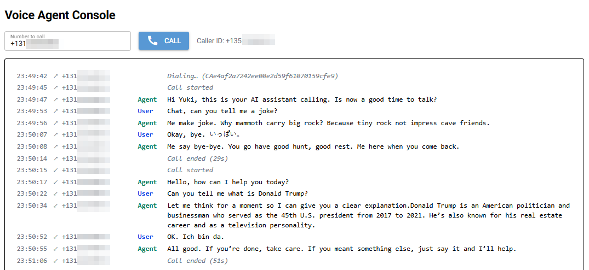

# Twilio + OpenAI Realtime Voice Agent

A minimal example connecting a Twilio phone call to an OpenAI Realtime voice agent using [Pipecat](https://github.com/pipecat-ai/pipecat), supporting both inbound and outbound calls.


## How it works

```
Caller dials Twilio number
    → Twilio sends POST /twiml
    → Server returns TwiML with <Stream> WebSocket URL
    → Twilio opens WebSocket to /twilio/{session_id}
    → Audio streams bidirectionally via OpenAI Realtime API
    → Caller hears the AI voice agent in real time
```

The agent can also place calls (CLI or the web console at `/ui`), and the console shows live transcripts of every call.

## Prerequisites

- [Twilio account](https://www.twilio.com/try-twilio) (free, includes $15 credit)
- [OpenAI API key](https://platform.openai.com/api-keys) with Realtime API access
- [ngrok](https://ngrok.com/download) for local development
- Python 3.12+ and [uv](https://docs.astral.sh/uv/getting-started/installation/)

---

## Step 1 — Set up Twilio

### Register a free account

1. Go to [twilio.com/try-twilio](https://www.twilio.com/try-twilio)
2. Sign up — Twilio gives you **$15 free credit** on registration
3. Verify your email and phone number

### Buy a phone number

1. In the Twilio Console, go to **Phone Numbers → Manage → Buy a number**
2. Search for a local number (US numbers cost ~$1.15/month)
3. Click **Buy** and confirm

Your Account SID and Auth Token are on the [Console homepage](https://console.twilio.com).

---

## Step 2 — Set up OpenAI

1. Go to [platform.openai.com/api-keys](https://platform.openai.com/api-keys)
2. Create a new secret key
3. Make sure your account has access to the Realtime API (`gpt-4o-realtime-preview`)

---

## Step 3 — Local setup

### Install dependencies

```bash
uv sync
```

### Configure environment

```bash
cp .env.example .env
```

Edit `.env` and fill in the required values:

| Variable | Required | Description |
|---|---|---|
| `OPENAI_API_KEY` | Yes | Your OpenAI secret key |
| `PUBLIC_BASE_URL` | Yes | Your ngrok `https://` URL (set after Step 4) |
| `TWILIO_ACCOUNT_SID` | Outbound only | Required for outbound calls and for programmatic hang-up |
| `TWILIO_AUTH_TOKEN` | Outbound only | Same as above |
| `TWILIO_PHONE_NUMBER` | Outbound only | Caller ID for outbound calls, in E.164 format (e.g. `+15555550100`). Must be a number owned by your Twilio account |
| `OPENAI_REALTIME_MODEL` | No | Defaults to `gpt-4o-realtime-preview` |
| `OPENAI_TRANSCRIPTION_MODEL` | No | Defaults to `gpt-4o-transcribe` |
| `OPENAI_VOICE` | No | TTS voice — defaults to `marin` |
| `OPENAI_TTS_SPEED` | No | Speech speed multiplier — defaults to `1.0` |
| `AGENT_INSTRUCTIONS` | No | System prompt for the agent |
| `AGENT_GREETING` | No | First thing the agent says when a call connects |
| `AGENT_OUTBOUND_GREETING` | No | First thing the agent says on calls it places itself |

---

## Step 4 — Expose the server with ngrok

In a terminal, start ngrok:

```bash
ngrok http 8000
```

Copy the `https://` forwarding URL (e.g. `https://example.ngrok-free.app`) and set it as `PUBLIC_BASE_URL` in your `.env`.

---

## Step 5 — Configure the Twilio webhook

1. In the Twilio Console, go to **Phone Numbers → Manage → Active numbers**
2. Click your phone number
3. Open the **Configure** tab
4. Under **Voice Configuration**, set:
   - **A call comes in**: `Webhook`
   - **URL**: `https://your-ngrok-domain.ngrok-free.app/twiml`
   - **HTTP**: `HTTP POST`
5. Click **Save configuration**

The server responds to that webhook with TwiML that tells Twilio to open a WebSocket stream back to your server:

```xml
<Response>
  <Connect>
    <Stream url="wss://your-ngrok-domain.ngrok-free.app/twilio/dev-session" />
  </Connect>
</Response>
```

---

## Step 6 — Run and test

Start the server:

```bash
uv run uvicorn app.main:app --host 0.0.0.0 --port 8000
```

Verify it's reachable:

```bash
curl https://your-ngrok-domain.ngrok-free.app/health
# → {"status":"ok"}
```

Call your Twilio number — you should hear the agent greeting within a few seconds.

Run a **single** uvicorn worker (the default). The call console below keeps its live events in memory inside this process, so `--workers N` would split them across processes.

---

## Call console — dial and watch live transcripts

The same server hosts a web console built with [NiceGUI](https://nicegui.io). Open it on the machine running the server:

```
http://localhost:8000/ui
```

- Type a number in E.164 format (e.g. `+15555550199`) and press **Call** or Enter. The agent calls it from `TWILIO_PHONE_NUMBER`, exactly like the CLI below.
- Every call appears live, whether it was placed from the console, placed from the CLI, or received on the Twilio number. Each line shows local time, direction (`↗` outbound, `↙` inbound), the other party's number, the speaker (`User` / `Agent`) and the transcript.
- Lines appear once per finished utterance, about a second after the speaker stops. Status lines show dialing, call started and call ended with its duration.
- The last 500 events stay in memory, so reloading the page keeps recent calls. Restarting the server clears them.

**Local only.** ngrok exposes the whole server, so requests arriving through ngrok (they carry `X-Forwarded-For`) or with a non-localhost `Host` can only reach Twilio's endpoints: `/health`, `/twiml`, `/twiml/outbound` and `/twilio/*`. Everything else, including `/ui`, returns 403. Open the console via `localhost`, not via the ngrok URL.

How transcripts get there:

```
Twilio POST /twiml or /twiml/outbound
    → TwiML <Stream> carries <Parameter> direction + remote (from Twilio's From / To form fields)
    → WebSocket handler publishes call_started / call_ended      (app/call_events.py)
    → Pipecat aggregator events publish each User / Agent line   (app/realtime.py)
    → in-process CallEventHub → every open console page          (app/ui.py)
```

---

## Outbound calling — have the agent call you

The agent can also place the call. Twilio dials the target number from `TWILIO_PHONE_NUMBER`; when the callee answers, Twilio fetches `POST /twiml/outbound`, which streams into the same WebSocket and pipeline as inbound calls. The only difference is the opening line, which comes from `AGENT_OUTBOUND_GREETING`.

```
python -m app.outbound +1XXXXXXXXXX
    → Twilio REST API creates the call (From = TWILIO_PHONE_NUMBER)
    → Callee answers → Twilio POST /twiml/outbound
    → <Stream> with <Parameter name="direction" value="outbound"/>
    → Same /twilio/{session_id} WebSocket → agent speaks AGENT_OUTBOUND_GREETING
```

Requirements: the server and ngrok are running, and `PUBLIC_BASE_URL` matches the current ngrok URL. The Console webhook is **not** used for outbound calls.

```bash
# Validate and print To / From / Url without calling
uv run python -m app.outbound +15555550199 --dry-run

# Place the call; prints the Twilio Call SID
uv run python -m app.outbound +15555550199
```

Exit codes: `0` success, `1` Twilio rejected the request, `2` invalid number or missing settings. The target number must be E.164 (`+` country code, digits only). The caller ID always comes from `.env` and cannot be overridden from the command line.

---

## Tests

```bash
uv run pytest -q
```

---

## Notes

- **ngrok URL changes on every restart.** Each time you restart ngrok you must update `PUBLIC_BASE_URL` in `.env` *and* the webhook URL in the Twilio Console. A paid ngrok plan gives you a stable domain.
- **A2P 10DLC.** The Twilio Console may show a banner about A2P 10DLC registration. This only applies to SMS/MMS — it does not affect voice calls.
- **Emergency address warning.** Twilio may warn about a missing emergency address. Add one in the Console to avoid a $75 fee per emergency call.
- **TWILIO_ACCOUNT_SID / TWILIO_AUTH_TOKEN** are optional for basic inbound call handling. They are needed for outbound calls, and if you want the agent to hang up calls via the Twilio REST API (set `auto_hang_up=True` in `twilio_handler.py`).

---

## Changelog

## v1.2 Call console - 9/24/2026
- `app/ui.py` (NiceGUI, mounted at `/ui`): enter a number to have the agent call it, and watch every call's transcript live with local timestamps, direction, remote number and speaker, for inbound and outbound calls alike.
- `app/call_events.py`: in-process event hub plus a per-call reporter; the WebSocket handler publishes call start/end and each finished User/Agent utterance, and every open console page subscribes.
- TwiML now passes `direction` and `remote` (caller for inbound, callee for outbound, read from Twilio's form fields) as stream parameters, XML-escaped. Inbound TwiML therefore gains these parameters.
- `app/access_guard.py`: ASGI guard so that through ngrok only Twilio's endpoints are reachable; the console and its WebSocket answer 403 / close code 1008.
- Upgraded Pipecat 1.2.1 → 1.11.0: migrated `PipelineTask`/`PipelineRunner` to `PipelineWorker`/`WorkerRunner`; the context aggregator runs in `realtime_service_mode` with explicit external turn strategies (OpenAI's server-side VAD proposes turns, the aggregator turns proposals into barge-in); caller transcripts come from `on_user_turn_message_added`. Added `nicegui` and `python-multipart`; FastAPI/Starlette/uvicorn moved up accordingly.
- Fix: Ctrl+C no longer stopped the server after the first call. Pipecat's runner replaced the SIGINT handler (via `signal.signal` on Windows) and never restored it; the call runner now uses `handle_sigint=False` so uvicorn keeps control of shutdown. Also switched to `add_workers()` + `run()`, as passing a worker to `run()` is deprecated.
- Tests for the event hub, reporter, TwiML parameters, access guard, console formatting/dialing, and turn-taking and transcript capture against a scripted realtime service.

## v1.1 Outbound calling - 9/24/2026
- `app/outbound.py`: CLI (`python -m app.outbound <E.164 number> [--dry-run]`) that places an outbound call through the Twilio REST API, so the agent can call a user instead of only answering. Caller ID is locked to `TWILIO_PHONE_NUMBER` because the Twilio account is shared.
- `POST /twiml/outbound` + `direction` stream parameter: outbound calls reuse the existing WebSocket/Pipecat pipeline but open with `AGENT_OUTBOUND_GREETING`; inbound TwiML output is unchanged.
- Fix: agent replies were cut off ~1s after starting. Pipecat's default local turn strategies treated OpenAI Realtime's late caller transcript as a barge-in; the context aggregator now uses `ExternalUserTurnStrategies`, so only OpenAI's server-side VAD interrupts the agent.
- `tests/`: pytest suite for the outbound module, CLI exit codes, TwiML routes, greeting selection and turn-taking.

## v1.0 Major - Twilio + OpenAI Realtime voice agent
- Inbound Twilio calls streamed to an OpenAI Realtime voice agent via Pipecat.
